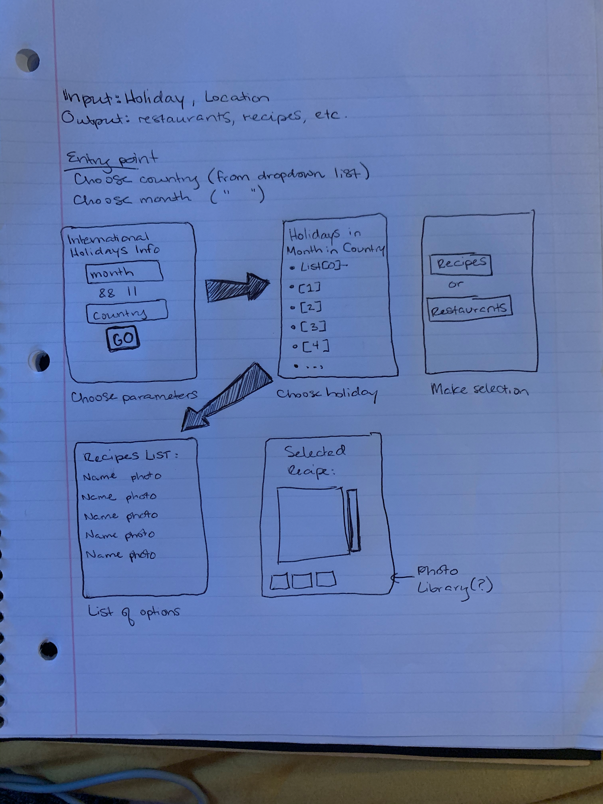

# Project-1

Group #4

Members: Caroline Strickland, Christian Ramirez, Jeffrey Kornfeld, Baur Kereibayev, Sara McGuinn

Project Title: Let's Celebrate 

Project Description: Project will allow users to search for holidays in a particular country and get recipes and local restaurants associated with that country’s cuisine.

User story: As a person curious about different countries, I want to experience aspects of culture such as holidays and food so I can learn more about international destinations.

Design:

APIs Used: 
Calendarific: https://calendarific.com
The Meal DB: https://www.themealdb.com
Zomato: https: https://developers.zomato.com
Google Maps: https://googlemaps.com

Framework: Foundation

Retrospective:

Caroline - I was awarded the task of CSS and styling for Let's Celebrate. I utilized some elements of Foundation, such as the button styling. However, most of the styling was applied to our dynamically generated elements on our CSS stylesheet. There was a little bit of an adjustment in effectively styling dynamically generated content and properly targeting items if they were nested within a div, section or card. But all in all this project was nice in being able to not only apply styling through the stylesheet but also through appendages in JavaScript.

Christian - I was responsible for using and creating an AJAX call for the maps Javascript API within google maps. One of the biggest challenges was finding a way to have a world map image preset when opening the application in the browser. The google maps API has an easy to follow guide on how to their API overall with having to do a few outside google searches to modify it how you would like to. Nonetheless, throughout the project, I was able to further practice javascript and look at different other APIs.

Jeffrey - I worked on the ajax calls and APIs both on my own and with Sara. Working on small tasks as a team was incredibly beneficial and we were able to achieve a lot more in a shorter amount of time working together. The hardest challenge was making sure everyone was up-to-date with pulls from GitHub so that we weren't changing an important line of code that was already updated in a previous version. Once we organized our workflow and communicated more, pulling and pushing to GitHub became second-nature.

Baur - Working on a project in a group was an enjoyable challenge. We had to quickly adapt to the changes and learn how to efficiently work as a team of developers. My focus throughout the project was on coordinating the team and conducting the team discussions. Additionally, I had worked on creating and maintaining a repository, and creation of the initial HTML skeleton. Later in the project, I had the responsibility of creating the presentation and testing the project on multiple platforms as well as using various web-browsers. 

Sara - This project has been a valuable experience. As with all assignments, I learned new skills such as working with new APIs, and I had opportunities to refine and apply past skills, such as nested for-loops. However, working with a group and using GitHub to put together a final deployable application was the newest challenge so far in this class. I think we all worked well together, complementing each others' skillsets and adapting to changes as necessary. Our final project turned out better than I had anticipated. I still have concerns about the usability of the app from a cultural standpoint: some religious holidays are not celebratory events, and it is inappropriate to celebrate some holidays with food. However, because we were limited by the information available in the free APIs, I think our app makes use of what we had in the best way possible.

Deployed Link: https://kbaur775.github.io/letscelebrate/
GitHub Repository: https://github.com/kbaur775/Project-1

Additonal Comments: 
Project runs on 6 major web brosers including Google Chrome, Safari, Firefox, Microsot Edge, Opera and Vivaldi. Project could also be accessed by using mobile phone, tablet, wide screen.

